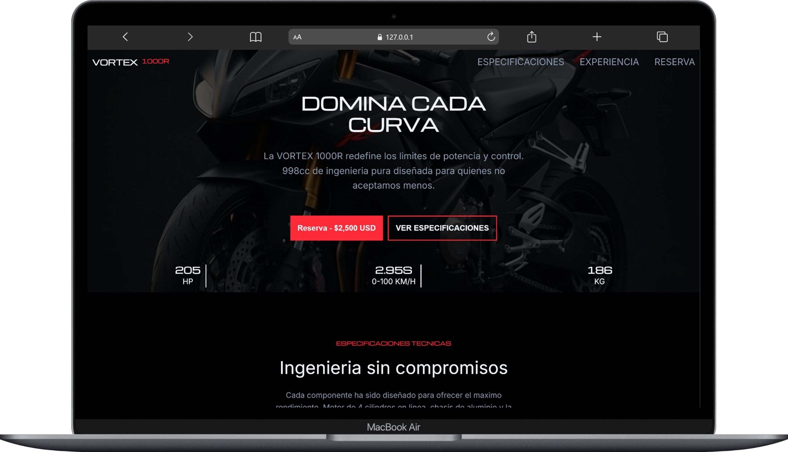

# VORTEX 1000R

- **Hero con imagen de fondo dramatica, titulo con tipografia serif impactante, CTA de reserva y estadisticas clave (205 HP, 2.9s 0-100, 186 kg).**

- **Especificaciones en grid minimalista con hover effects, mas una imagen panoramica del motor.**

- **Experiencia con listado de features premium (Ohlins, Brembo, quickshifter) e imagen de accion**

- **Formulario de pre-venta con precio con descuento, barra de urgencia (unidades restantes), y un formulario completo con estado de confirmacion**

- **Footer con links de navegacion organizados**

- **El tema usa una paleta oscura premium con acentos en rojo que transmiten potencia y exclusividad**

